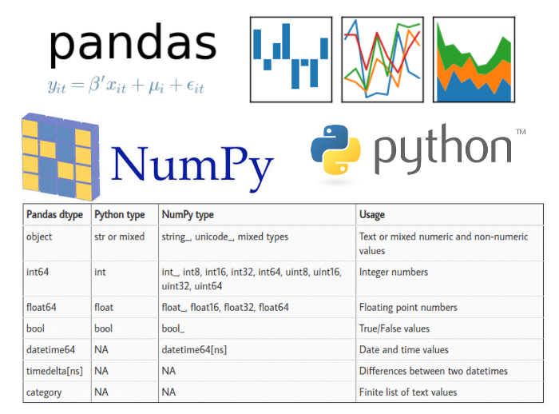

Now let's pull down what very well might be your first ever dataset in Jupyter!

We'll spend this chapter learning some simple Pandas methods for understanding what a dataset looks like and what it contains. These will help you get your bearings when you start with any dataset. (nautical puns intended!)

# Getting the Titanic Dataset

Head over to the [Kaggle Titanic Competition](https://www.kaggle.com/c/titanic/data) webpage and on the "Data" tab click "Download" to get the csv of Titanic data.

Next, in your Jupyter Notebook, click the "Upload" button and find  the file `titanic/train.csv` and upload it into your Jupyter Notebook. Rename it 'titanic.csv'.

Remember to change the name of your notebook to be "Titanic-Description" because we're focusing on describing the Titanic data using mean, median, mode, range, and variance.

Because the Titanic data is a table, and not a simple array, we are going to use the Pandas python library which affords us similar methods as NumPy but is built to handle more complex data sets that have multiple labeled columns.

Let's load the Titanic data into a Pandas DataFrame object by using the Pandas `.read_csv()` method. Then we'll call the `.head()` function to review that the data is loading properly.

```py
df = pd.read_csv('titanic.csv')
df.head()
```

# Shape

One of the first things to do is just see how big your dataset is. How many columns or "features" and how many rows or "elements". We can get that by using the `.shape()` method:

```py
df.shape
```

# Features the Data Dictionary

Columns in a table of data like this are called "Features" in data science. From the `.head()` method you could see the names of the features, but what do they mean? What is `sibsp`? Or `parch`? To know this you have to look at the data dictionary. This dataset has a clear data dictionary on [its page in kaggle.com](https://www.kaggle.com/c/titanic/data).

Review the meaning of each feature.

Scroll through the data and look at it all. What do you notice? What questions or hypothesis are coming up for you that you want tests or prove?

# Data Types

Like in software engineering, each feature will always have a data type which will determine what sorts of methods you can call on that feature.

To see the features and their data types use the `.dtypes()` method:

```py
df.dtypes
```

Anything stand out to you?

In future chapters, you'll learn how to transform the datatype of columns, e.g. turning a string into an integer, in order to do the analysis you want.

Pandas types are not the same as Python's types, but there is a simple mapping:



# Null Values

Data is not perfect and in even a very clean dataset there will likely be values that are blank, `NaN`, etc.

You can use the `.isnull()` Pandas method to see what values are null.

```py
df.isnull().sum()
```

When a value is null it is left out of calculations, so keep this in mind when you are calling future methods.

There are lots of ways of dealing with null data, but the most common way to deal with it is to leave it out!
