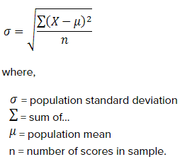

Now lets start to look at how we can start to describe data and begin to get our bearings so we can start to ask questions and discover insights.

# Variance

**Variance** is another piece of descriptive statistics. It is a measure of how spread out the data is or to put it another way it measures how far a set of numbers is spread out from their average value.

We can use the NumPy function `.var(arr)` to find the variance score of an array. The `.var(arr)` function uses "the average of the squared deviations from the mean"—which in english reads: The average of the square of the absolute difference between each element and the average of the whole dataset.

```
var = np.mean((x - np.mean(x))**2)
```

In a Juypter Notebook, use the following code to calculate the variance of two arrays:

```py
low_variance = [7,8,7,8,9,6,7,7,7,8,9,8,7,4]

print("Variance:", np.var(low_variance))
print("Mean:", np.mean(low_variance))
print("Min:", np.min(low_variance))
print("Max:", np.max(low_variance))
print("Range:", np.max(low_variance) - np.min(low_variance))

```

Now lets look at a series with high variance:

```py
high_variance = [102,2,50023,30,3040,50,20,1,50,-304,-50349]

print("Variance:",np.var(high_variance))
print("Mean:", np.mean(high_variance))
print("Min:", np.min(high_variance))
print("Max:", np.max(high_variance))
print("Range:", np.max(high_variance) - np.min(high_variance))
```

# Standard Deviation

Another key metric for explaining variance is to take a series' **standard deviation**.

Standard deviation is defined as the squareroot of the sum of the square of all deviations from the mean divided by one less the total number of values.



As a challenge, write the python for each step to create your own standard deviation function. Then check your work, using the NumPy `.std()` function.

```py
def standard_deviation(series):
  # Compute the mean of the series
  # Find the squares of all the deviations from the mean
  # Sum the squares of the deviations from the mean
  # Divide this sum by the total number of data values
  # Take the squareroot of this quotient.
```

Run your function against the NumPy `.std()` function.

```py
print("Standard Deviation:", standard_deviation(low_variance))
print("Standard Deviation:", np.std(low_variance))

print("Standard Deviation:", standard_deviation(high_variance))
print("Standard Deviation:", np.std(high_variance))
```

Notice that the standard deviation of the low_variance is quite low, and of high variance is quite high.

# Variance in Features in the Titanic Dataset

So let's see what some of the variance in the Titanic Dataset was? Let's try to answer one question about variance:

1. What was the variance in ages on the Titanic? Were people mostly near the same age, or was there a wide variety of ages?

We can use the `.var(column)` Pandas method to get a column's (or in data science-speak a feature's) variance

```py
df = pd.read_csv('titanic.csv')
df.var()
```

You ought to see that the variance in Age was `211.019125`, but what does this mean?

# Wrapping Our Heads Around Variance

Remember that variance is measured by "the average of the squared deviations from the mean." Let's see if we can understand what the age variance means by comparing it with the fare varianc, which we can see is `2469.436846`, about 10x higher.

We can compare these two by plotting how many passengers fell into each age and each fare. Recording a count of each value in a column is called a histogram so we'll use the Pandas `.hist(column)` method.

```py
df.hist('Age')
df.hist('Fare')
```

Variance is about how far away elements are from the average, so let's pull up the averagse of these two features with the `.describe()` method:

```py
df.describe()
```

So if the mean age is roughly 30 years old, and the mean fare was $32.20. We can start to see the large variance in fare because the max fare was $512.33, but the max age was only 80. Large variance!

# Getting Graphical!

These histograms already show that there is much more variance in fare than in age on the titanic, and help us understand the underlying statistical descriptor called variance. But if we draw in the average line, we'll see the variance very clearly.

If we want to add the average line into our graph, let's reimplement these histograms graphs using the matplotlib `.hist()` method.

### Matplotlib

To create our visualizations in Python we will be using the matplotlib library, which will give us the tools to easily create graphs and customize them. We will cover some of the matplotlib functionality in this lesson, but check out this resource if you want some more introduction to how to use this library.

The Pandas `.hist()` method is really calling the `matplotlib.hist` function under the hood! So switching to matplotlib is actually just exposing the mechanics that Pandas uses. You can start to see how the tools we are using are a suite of data analysis packages that sometimes duplicate or rely on each other.

Let's make an Age histogram using matplotlib

```py
import matplotlib.pyplot as plt

# Age Histogram
plt.hist(df.Age)
plt.axvline(df.Age.mean(), color='k', linestyle='dashed', linewidth=1)
plt.title('Ages of Passengers on Titanic')
plt.ylabel('Count')
plt.xlabel('Age (in Years)')
```

And now for Fare

```py
# Fare Histogram

plt.hist(df.Fare)
plt.axvline(df.Fare.mean(), color='k', linestyle='dashed', linewidth=1)
plt.title('Fares of Passengers on Titanic')
plt.ylabel('Count')
plt.xlabel('Fare (in Dollars)')
```

These two charts illustrate how fares had a much larger (10x) variance than ages did on the Titanic.


# +/- 1 Standard Deviation

Let's add lines for one standard deviation above and one below of the mean:

```py
# Age
plt.axvline(df.Age.mean()+df.Age.std(), color='k', linestyle='dashed', linewidth=1)
plt.axvline(df.Age.mean()-df.Age.std(), color='k', linestyle='dashed', linewidth=1)
```

```py
# Fare
plt.axvline(df.Fare.mean()+df.Fare.std(), color='k', linestyle='dashed', linewidth=1)
plt.axvline(df.Fare.mean()-df.Fare.std(), color='k', linestyle='dashed', linewidth=1)
```
