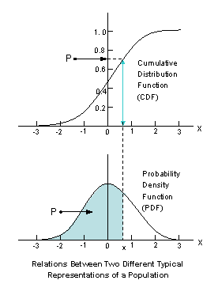

We've calculated some individual probabilities, but we can go further with probability. We can calculate and graph *every* probability, and thereby glean further insights into our data. A graph of every probability is called a **Probability Density Function**, and you've probably already seen them and heard of them, since they are popularly called **Bell Curves**.

https://towardsdatascience.com/histograms-and-density-plots-in-python-f6bda88f5ac0
https://stats.stackexchange.com/questions/48109/what-does-the-y-axis-in-a-kernel-density-plot-mean

# Explaining PDFs & CDFs

PDFs help us to make insights about the probability of an entire system. For a better understanding of PDFs, watch one of these primers in PDFs.


Whereas **PDFs** showed the probability of one specific x-value occurring, **CDFs** show the probability of all x-values up to a certain x occurring. In the PDF, the y-axis is the probability of any one x occurring. In the CDF, the y-axis is the percentage of values at or below that x value.



To visualize the relationship between PDFs and CDFs, review [Connecting the CDF and the PDF](https://demonstrations.wolfram.com/ConnectingTheCDFAndThePDF/) inside the Wolfram Demonstrations Project website.

# From Histogram => PDF

When we graph a PDF, it has a similar pattern to a histogram. The main difference is that instead of the y-axis corresponding to values, it shows the percent probability of the x-axis values. This is known as normalizing the values.

```py
import numpy as np
import pandas as pd

df = pd.read_csv('titanic.csv')
```

First let's look at the age in histogram form:

```py
import seaborn as sns
# create a list of Age values not including N/A values
ls_age = df['Age'].dropna()
# Now plot the data in this list into a histogram!
sns.distplot(ls_age, hist=True, kde=False, bins=16)
```

Now lets look at it with the PDF:

```py
import seaborn as sns
# Notice only the KDE parameter is different!
# What does kde stand for? https://seaborn.pydata.org/generated/seaborn.distplot.html
sns.distplot(df['Age'].dropna(), hist=True, kde=True, bins=16)
```

**Notice that the y-axes are different between the two!** The histogram is the value at an interval of the x-axis, and the PDF y-axis is the probability of being that value.

# Comparing PDF and CDF

Now let's create the CDF of the PDF we just did of the Age feature.

```py
sns.distplot(df['Age'].dropna(), hist_kws=dict(cumulative=True), kde_kws=dict(cumulative=True))
```

From this we can see very clearly the various probabilities. For instance, we can see:

```
Over 85% of the passengers of the Titanic were over 18
```
